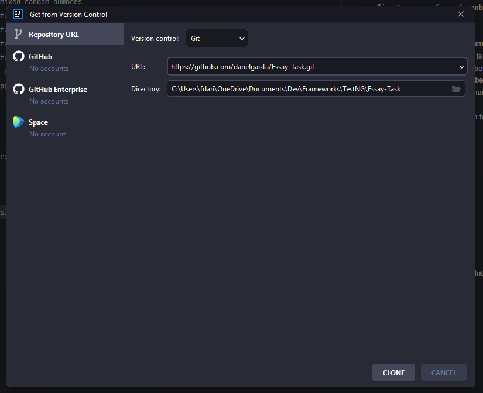
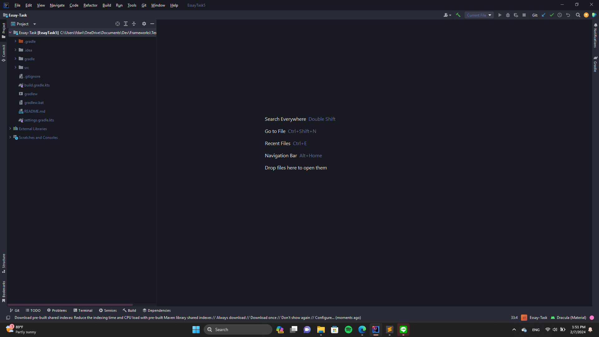
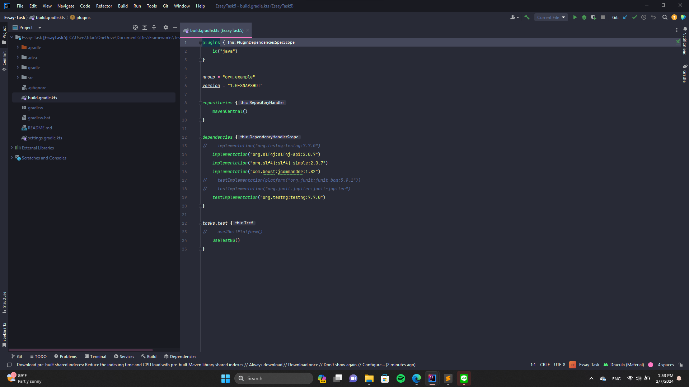
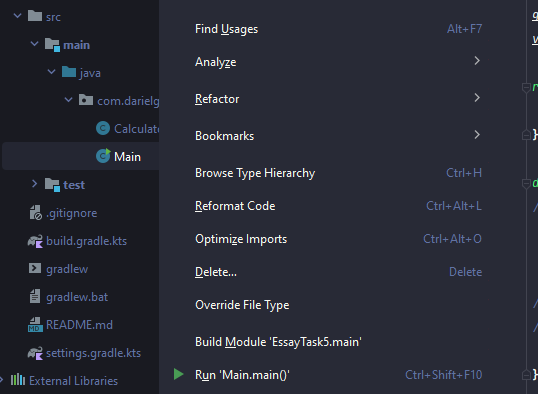
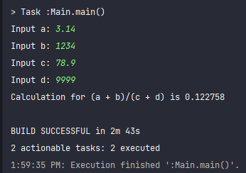
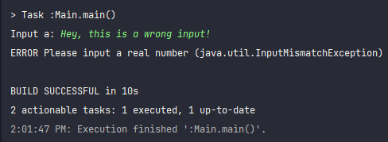
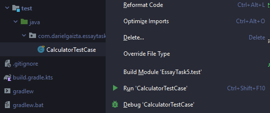
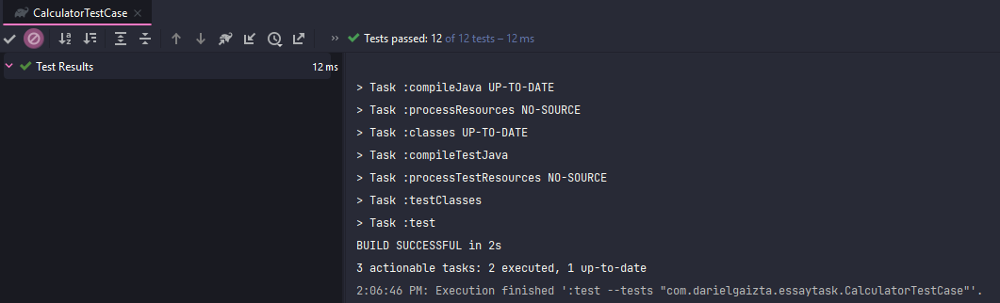

# Essay Task 5
Implement a program that calculates `(a + b) / (c + d)` where a, b, c, and d are real numbers.
Input the numbers through console. The program should be implemented so that it is robust to
different types of input data.

## Tech Stacks
I use **Java** with **TestNG** as its testing framework.

## Test Cases
I provide **12 Test Cases** which test the program if:
- all inputs are zeroes
- all inputs are positive real numbers
- all inputs are negative real numbers
- all inputs are large positive numbers
- all inputs are small positive numbers
- all inputs are large negative numbers
- all inputs are positive infinity
- all inputs are negative infinity
- the function returns negative number for positives divided by negatives
- the function returns negative number for negatives divided by positives
- the function returns Infinite if it is a zero division
- the function returns large positive number as a result
- the function returns small positive number as a result
- the function returns large negative number as a result
- the function returns a precise number
- the function is commutative

## Dependencies
- testng
- slf4j-api
- slf4j-simple (provider)
- jcommander

## How to Run
1. Clone the repository into your IntelliJ

2. After the clone is done, your IntelliJ should look like this

3. Open the build.gradle.kts file and make sure that everything is OK like in the following image

4. Open the `src/main/java/com.darielgaizta.essaytask` and right click on the Main.java file

5. Click the "Run 'Main.main()'"
6. IntelliJ will open the terminal and run the program. The program will ask for inputs (a, b, c, and d) like in the following image

7. Input any real numbers for `Input a`, `Input b`, `Input c`, and `Input d`. Output will be displayed by the program immediately

8. If your input is not a real number, program will be closed and log the error

## Testing
I use TestNG to do the testing. The test file is located in `src/test` directory. To run the test cases,
simply open the `src/test/java/com.darielgaizta.essaytask` and run the CalculatorTestCase.java file.
IntelliJ will open the terminal and display if all the test cases is passed or not.

